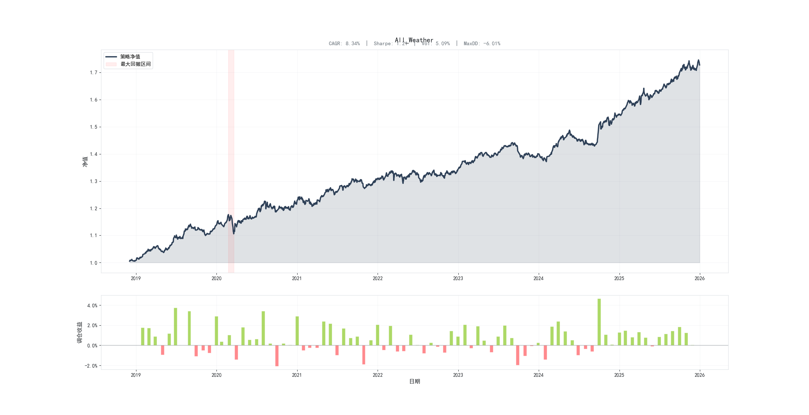
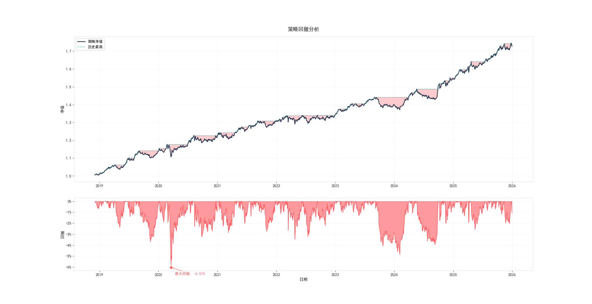

# ETF All-Weather Risk Parity Strategy

**基于宏观因子驱动的 ETF 全天候风险平价策略**

A systematic macro-driven multi-asset allocation framework using ETFs as implementation instruments.

---

## 📌 Project Overview / 项目概述

This project implements a robust **All-Weather Risk Parity Strategy** designed to perform across different macroeconomic regimes. Unlike traditional risk parity, this strategy incorporates **macro factor signals** to dynamically adjust asset correlations and risk budgets, with specific optimizations for China's A-share market environment.

本项目构建了一个能够跨越不同宏观周期的稳健配置模型。核心思路参考桥水全天候策略，将资产按照宏观四象限（增长×通胀）进行划分，通过三层权重穿透机制实现最终的资产配置。

---

## 🎯 Research Motivation / 研究动机

**English:**
- Translate macroeconomic signals into systematic asset allocation decisions
- Focus on robustness and risk diversification rather than short-term return optimization
- Build portfolios that can weather different market regimes

**中文：**
- 将宏观经济信号转化为系统化的资产配置决策
- 关注策略稳健性和风险分散，而非短期收益最大化
- 构建能够适应不同市场环境的投资组合

---

## 📂 Repository Structure / 项目结构

```
ETF_allweather/
├── config/                          # 配置文件 Configuration Files
│   
│   
├── data/                            # 数据目录 Data Directory
│   ├── ETF_daily_simple_returns.csv              # ETF日度收益率
│   ├── index_daily_simple_returns.csv            # 指数日度收益率
│   ├── all_macro_factors.csv                     # 宏观因子数据
│   ├── ETF_aum_amount.csv                        # ETF份额数据
│   └── ETF_aum_unit_value.csv                    # ETF单位净值数据
│
├── src/                             # 源代码 Source Code
│   ├── framework/                   # 核心框架模块 Core Framework
│   │   ├── allocation_utils.py     # 权重分配工具 (HRP, Risk Parity)
│   │   ├── config.py               # 全局参数配置
│   │   ├── etf_flow_momentum.py    # ETF份额动量择时模块
│   │   ├── load_data.py            # 数据加载模块
│   │   ├── monte_carlo.py          # Monte Carlo 稳健性验证
│   │   ├── performance.py          # 绩效计算模块
│   │   └── plotting.py             # 可视化绘图模块
│   │
│   ├── factors/                     # 因子研究模块 Factor Research
│   │   ├── macro_factor_composite.py             # 宏观因子合成
│   │   └── Study_macro_factor_exposure_v2.py     # 因子暴露研究
│   │
│   └── strategies/                  # 策略实现 Strategy Implementation
│       ├── strategy_AllWeather_v5.py             # 主策略文件 (最新版本)
│       └── archive/                              # 历史版本存档
│
├── scripts/                         # 运行脚本 Execution Scripts
│   ├── run_monte_carlo_validation.py             # Monte Carlo 验证策略稳健性
│   └── run_all_strategy_compared.py              # 比较策略不同参数设置的结果
│
└── results/                         # 输出结果 Results Output
    ├── strategies/                  # 策略回测结果
    │   ├── plot/                   # 可视化图表
    │   ├── tables/                 # 数据报表
    │   └── logs/                   # 运行日志
    └── monte_carlo/                 # Monte Carlo 验证结果
```

---

## 🔄 Strategy Framework / 策略框架

### Core Logic / 核心逻辑

The strategy follows a **top-down investment process** with a three-layer weight penetration mechanism:

策略采用**自上而下的投资流程**，通过三层权重穿透机制进行资产配置：

```
┌─────────────────────────────────────────────────────────────────┐
│                    MACRO REGIME IDENTIFICATION                   │
│                       宏观环境识别                                │
│                                                                  │
│   ┌──────────────┐  ┌──────────────┐  ┌──────────────┐         │
│   │   Growth     │  │  Inflation   │  │  Monetary    │         │
│   │   增长因子    │  │  通胀因子    │  │  货币政策    │          │
│   └──────────────┘  └──────────────┘  └──────────────┘         │
└─────────────────────────────────────────────────────────────────┘
                              │
                              ▼
┌─────────────────────────────────────────────────────────────────┐
│                    QUADRANT CLASSIFICATION                       │
│                       四象限分类                                  │
│                                                                  │
│   ┌───────────────────────┬───────────────────────┐             │
│   │    Growth Rising      │   Inflation Rising    │             │
│   │    增长上行           │    通胀上行           │              │
│   │                       │                       │             │
│   │  Stock + Commodity    │  Commodity + Gold     │             │
│   │  + Credit Bond        │                       │             │
│   ├───────────────────────┼───────────────────────┤             │
│   │    Growth Falling     │   Inflation Falling   │             │
│   │    增长下行           │    通胀下行           │              │
│   │                       │                       │             │
│   │  Rates Bond + Gold    │  Dividend Stock       │             │
│   │                       │  + Rates Bond         │             │
│   └───────────────────────┴───────────────────────┘             │
└─────────────────────────────────────────────────────────────────┘
                              │
                              ▼
┌─────────────────────────────────────────────────────────────────┐
│               THREE-LAYER WEIGHT PENETRATION                     │
│                   三层权重穿透                                    │
│                                                                  │
│   Layer 1: ETF Layer (Bottom)                                   │
│   第一层：ETF层（底层）                                           │
│   → Equal Weight (EW) or Hierarchical Risk Parity (HRP)         │
│                                                                  │
│   Layer 2: Asset Class Layer (Middle)                           │
│   第二层：资产类别层（中间层）                                      │
│   → Adjustable weights within each quadrant                    │
│                                                                  │
│   Layer 3: Quadrant Layer (Top)                                 │
│   第三层：象限层（顶层）                                           │
│   → Risk Parity across four quadrants                           │
│                                                                  │
└─────────────────────────────────────────────────────────────────┘
                              │
                              ▼
┌─────────────────────────────────────────────────────────────────┐
│                    TIMING ADJUSTMENTS                            │
│                       择时调整                                    │
│                                                                  │
│   ┌──────────────────────┐  ┌──────────────────────┐           │
│   │  Monetary Policy     │  │  ETF Flow Momentum   │           │
│   │  Position Sizing     │  │  份额动量择时         │            │
│   │  货币政策仓位调整     │  │  (Equity ETFs only)  │            │
│   └──────────────────────┘  └──────────────────────┘           │
└─────────────────────────────────────────────────────────────────┘

---

## 📊 Backtest Results / 回测表现

### Performance Metrics / 绩效指标

| Metric | Value |
|--------|-------|
| **CAGR (年化复合收益)** | 8.34% |
| **Annual Volatility (年化波动率)** | 5.09% |
| **Sharpe Ratio (夏普比率)** | 1.21 |
| **Calmar Ratio** | 1.39 |
| **Sortino Ratio (索提诺比率)** | 1.67 |
| **Max Drawdown (最大回撤)** | -6.01% |
| **Max DD Period** | 2020-02-24 ~ 2020-03-19 |
| **Rebalance Win Rate (换仓胜率)** | 68.24% |
| **Profit/Loss Ratio (盈亏比)** | 1.68 |

### Annual Returns / 年度收益

| Year | Return |
|------|--------|
| 2018 | 0.22% |
| 2019 | 12.80% |
| 2020 | 7.66% |
| 2021 | 6.22% |
| 2022 | 2.35% |
| 2023 | 3.98% |
| 2024 | 10.26% |
| 2025 | 11.70% |

### Equity Curve / 净值曲线



### Drawdown Analysis / 回撤分析



### Robust Analysis / 稳健性分析


---

## ⚙️ Configuration / 配置说明

Key parameters in `strategy_AllWeather_v5.py`:

```python
# Strategy Parameters / 策略参数
internal_method = 'EW'           # 象限内分配方法: 'EW' or 'HRP'
top_cov_estimate_ways = 'cov'    # 协方差估计: 'cov', 'ewm', 'oas'
lookback_years = 3               # 回看窗口年数

# ETF Flow Momentum / 份额动量择时
use_etf_flow_momentum = True     # 是否启用份额动量
flow_lookback_months = 3         # 资金流回看月数
flow_max_overweight = 0.2        # 最大超配比例

# Monetary Position Sizing / 货币政策仓位
use_monetary_position_sizing = False
max_position = 1.0               # 最大仓位
min_position = 0.8               # 最小仓位
```

---

## 📈 Future Improvements / 未来优化方向

- [ ] Add more asset classes (REITs, Overseas ETFs)
- [ ] Implement Black-Litterman model for return forecasting
- [ ] Implement more macro or industry factors for risk budget 
- [ ] Add transaction cost optimization

---

## 👤 Author

Peilin Huang

- Email: seanhuang5277@gmail.com
- Github: https://github.com/seanhuang5277


